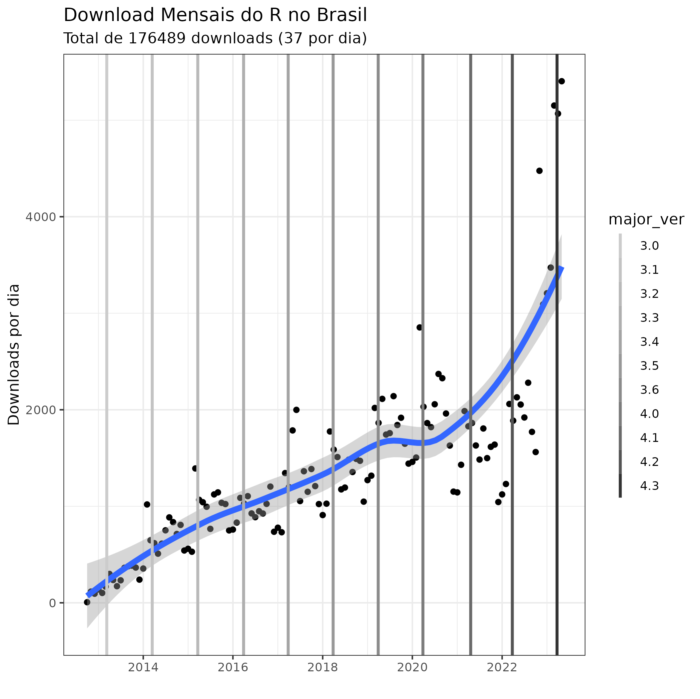
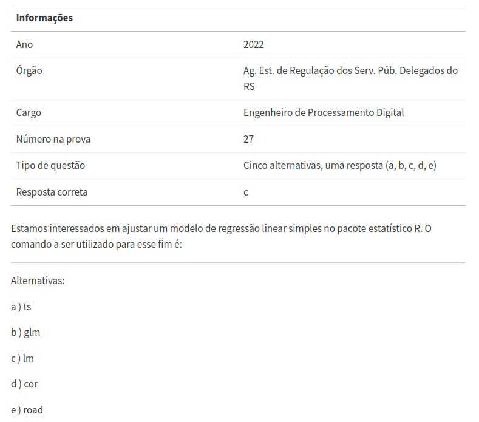

## Roteiro
```{r}
library(emojifont)
classtools::setup_quarto_slides("templates")
```

- Por que usar o R?
- Lançamento do livro "Questões do R em Concursos Públicos"
- Questões comentadas


## Quem sou eu?

> Professor Associado de pós-graduação da Escola de Administração da UFRGS, com mais de 15 anos de experiência em análise de dados e produção de ciência. [https://www.msperlin.com/blog/](https://www.msperlin.com/blog/)

. . .

- apaixonado por análise de dados e programação 
- autor e mantenedor de diversos pacotes no CRAN: `yfR` (antigo `BatchGetSymbols`), `GetTDData`, `GetDFPData2`, `GetBCBData`, ...

. . .

## Livros Escritos

:::: {.columns}

::: {.column width="25%"}
```{r}
knitr::include_graphics('figs/CAPA_Marcelo_RendaFixa_2022.jpg')
```

:::

::: {.column width="25%"}
```{r}
knitr::include_graphics('figs/CAPA-VisualizacaoDadosR-EBOOK.jpg')
```
:::

::: {.column width="25%"}
```{r}
knitr::include_graphics('figs/CAPAdigital-AnaliseDadosR.jpg')
```
:::

::: {.column width="25%"}
```{r}

```
:::

::::

## O que é o R

> O R é uma linguagem de programação voltada para a resolução de problemas estatísticos e para a visualização gráfica de dados. 

. . .

Autores: Ross Ihaka e Robert Gentleman (_The University of Auckland_), criada em 1993

. . .

Funcionalidade: R é sinônimo de programação voltada à análise de dados

. . .

Custo: **O R é totalmente livre** e disponível em vários sistemas operacionais.


## Por que Escolher o R

. . .

- Plataforma <span style="color:red">gratuita</span>, madura, estável, e continuamente suportada.

. . .

- Mais de 20k pacotes/módulos no CRAN

. . .

- Oferece ferramentas para o ciclo completo de análise de dados (pesquisa -> comunicação)

. . .

- Está se tornando um requisito no mercado de trabalho (e vai lhe ajudar a conseguir um emprego! `r emoji("money_mouth_face")`)

## Downloads do R no Brasil

```{r}

```


# Questões do R em Concursos Públicos

## Motivação

- Aumento da relevância do R (e programação) no mercado de trabalho

. . .

- Inexistência de material curado sobre o conhecimento necessário de R em concursos

. . .

- Questões "rasas" no assunto: 

```{r}

```

## Conteúdo do Livro

- 35 questões de concursos entre 2018 e 2022, de 13 diferentes cargos e 11 diferentes órgãos públicos

```{r}
#| include: false

#source("_common.R")

path_questions <- '~/GDrive/05-books/06-QRCP/01-r-scripts/02-compile-book/book-content/questions'
df_q <- qrcp::get_df_questions(path_questions)

n_q <- nrow(df_q)
n_orgaos <- dplyr::n_distinct(df_q$orgao)
n_cargos <- dplyr::n_distinct(df_q$cargo)

#cat(paste0(c(n_q, n_orgaos, n_cargos)))

```

```{r, echo=FALSE}
#| layout-ncol: 2
#| label: fig-questoes
#| fig-cap: "Número de questões por ano e órgao"
#| fig-subcap:
#|   - "Número de questões e ano"
#|   - "Número de questões e órgão"

require(ggplot2, quietly = TRUE)

# by year
tbl_year <- df_q |>
    dplyr::group_by(year) |>
    dplyr::count()

p1 <- ggplot(tbl_year, aes(x = year, y = n)) + 
    geom_col() + 
    labs(x = "Ano", y = "Número de questões") + 
    theme_minimal() + 
    geom_text(aes(label = n), nudge_y = 1)

# by orgao
tbl_orgao <- df_q |>
    dplyr::group_by(orgao) |>
    dplyr::count() |>
    dplyr::left_join(
        qrcp::get_abb_table(),
        by = 'orgao'
    )

p2 <- ggplot(tbl_orgao, aes(
    y = forcats::fct_reorder(abb, n), x = n)) + 
    geom_col() + 
    labs(x = "Número de Questões", y = "Órgão") + 
    theme_minimal() + 
    geom_text(aes(label = n), nudge_x = 0.5)

print(p1)
print(p2)
```

# Exemplo de Questões

## Versão online

Ebook/versão impressa disponível na [Amazon](https://www.amazon.com.br/dp/B0C6GZ6V8T)

Versão online em <https://msperlin.com/qrcp/>


## Referências {-}  
