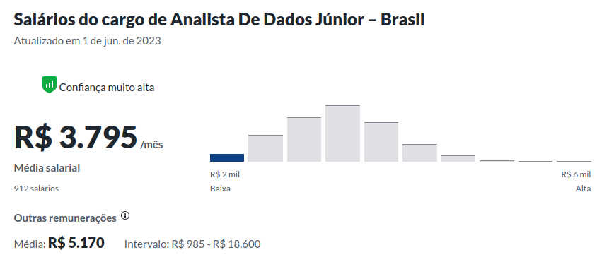
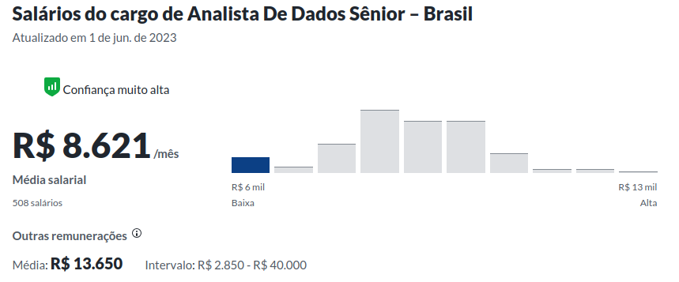

```{r}
#| echo: false
classtools::setup_quarto_slides("templates")
```


## Programação

- Sobre o autor
- Sobre o R
- Carreira de analista de dados




## Quem sou eu? 

- Professor de graduação e pós-graduação da Escola de Administração da UFRGS. [marceloperlin@gmail.com](emailto:marceloperlin@gmail.com) | [https://www.msperlin.com/blog/](https://www.msperlin.com/blog/)

- Desenvolvedor e mantenedor de pacotes _open source_ do R

- Apaixonado por análise de dados e produção de ciência

## Livros

:::: {.columns}

::: {.column width="25%"}
```{r}
knitr::include_graphics('figs/CAPA_Marcelo_RendaFixa_2022.jpg')
```

:::

::: {.column width="25%"}
```{r}
knitr::include_graphics('figs/CAPA-VisualizacaoDadosR-EBOOK.jpg')
```
:::

::: {.column width="25%"}
```{r}
knitr::include_graphics('figs/CAPAdigital-AnaliseDadosR.jpg')
```
:::

::: {.column width="25%"}
```{r}
knitr::include_graphics('figs/CAPA-Questoes-de-R-EBOOK.jpg')
```
:::

::::

## O que é o R {background-image="figs/R_logo.svg.png" background-opacity=0.5}

> O R é uma linguagem de programação voltada para a resolução de problemas estatísticos e para a visualização gráfica de dados. 

- Autores: Ross Ihaka e Robert Gentleman (_The University of Auckland_), criada em 1993

- Funcionalidade: R é sinônimo de programação voltada à análise de dados

- Custo: **O R é totalmente livre** e disponível em vários sistemas operacionais.


## Por que Escolher o R {background-image="figs/R_logo.svg.png" background-opacity=0.5}

- Plataforma <span style="color:red">gratuita</span>, madura, estável, e continuamente suportada.
- quantidade absurda de módulos adicionais
- fácil de aprender

. . .

- **Permite trilhar uma carreira profissional em análise de dados! **

# {background-image="figs/Show-Me-The-Money-Memes-1.jpeg" background-size="contain"	}

## Carreira de Analista de Dados

- a ciência de dados é uma tendência positiva no mercado de trabalho

. . .

- salários altos, com uma demanda maior do que a oferta

. . .

- boa qualidade de vida, com possibiliade de trabalhar para o exterior


## Sálarios Analista de dados junior {background-image="figs/money-background.png" background-opacity=0.5}

```{r}

```

## Sálarios Analista de dados senior  {background-image="figs/money-background.png" background-opacity=0.5}

```{r}

```

# Exemplos de Aplicação

## O lucro histórico da Petrobrás (PETR3)

```{r}
#| cache: true
#GetDFPData2::search_company("petrobras")
id <- 9512

l_dfp <- GetDFPData2::get_dfp_data(id, first_year = 2010,
                                   type_docs = c("DRE", "BPA", "BPP"),
                                   type_format = 'ind')

bpa <- l_dfp$`DF Individual - Balanço Patrimonial Ativo`
bpp <- l_dfp$`DF Individual - Balanço Patrimonial Passivo`
dre <- l_dfp$`DF Individual - Demonstração do Resultado`

this_company <- bpa$DENOM_CIA[1]

all_dfp <- dplyr::bind_rows(
  bpa,
  bpp,
  dre
)

#all_dfp <- classtools::simplify_dfp(all_dfp)

get_acc <- function(target, CD_CONTA, VL_CONTA) {
  idx <- which(target == CD_CONTA)
  return(VL_CONTA[idx])
}

my_tab <- all_dfp |>
  dplyr::group_by(DENOM_CIA, year = lubridate::year(DT_REFER)) |>
  dplyr::summarise(
    PL = get_acc("2.03", CD_CONTA, VL_CONTA),
    LL = get_acc("3.11", CD_CONTA, VL_CONTA*1000),
    vendas = get_acc("3.01", CD_CONTA, VL_CONTA),
    AT = get_acc("1", CD_CONTA, VL_CONTA),
  ) |>
  dplyr::ungroup() |>
  dplyr::mutate(
    ML = LL/vendas,
    GAT = vendas/AT,
    MPL = AT/PL,
    ROE = ML*GAT*MPL
  )

#my_tab |>
 # gt::gt() |>
  #gt::tab_header(title = "ìndices da {this_company}")
  
```

```{r}
library(ggplot2)

p <- ggplot(my_tab, 
            aes(x = year, y = LL)) + 
  geom_col() + 
  theme_light() + 
  scale_y_continuous(labels = classtools::format_cash) + 
  ggrepel::geom_text_repel(aes(label = classtools::format_cash(LL))) + 
  labs(title = glue::glue("Lucro Anual da {this_company}"),
       x = "Ano") + 
  theme_light()

p
```

## Retorno Real da Poupança

```{r poup-inflacao, fig.cap='Poupança e Inflação'}
require(dplyr)
require(ggplot2)

first_date <- Sys.Date() - 5*365
last_date <- Sys.Date()

df_poup <- GetBCBData::gbcbd_get_series(c(poupanca = 196),
                                        first_date,
                                        last_date) 

df_ipca <- GetBCBData::gbcbd_get_series(c(ipca = 433),
                                        first_date,
                                        last_date) 
value_invested <- 1000

first.date <- min(df_ipca$ref.date)
last_date <- max(df_ipca$ref.date)

df_poup <- df_poup %>%
  mutate(port_value = value_invested*cumprod(1+value/100))

df_ipca <- df_ipca %>%
  mutate(port_value = value_invested*cumprod(1+value/100))

df.to.plot <- bind_rows(df_poup, df_ipca) 

p <- ggplot(df.to.plot, aes(x = ref.date, y = port_value, linetype = series.name)) + 
  geom_line(linewidth = 1) + 
  labs(x = '', 
       y = 'Valor Acumulado') +
  scale_x_date(breaks = scales::pretty_breaks(12)) + 
  labs(title = 'Performance da Caderneta de Poupança e da Inflação',
       subtitle = paste0(
         'Investimento inicial = ', classtools::format_cash(value_invested), '\n',
         "Início em ", classtools::format_date(first.date),' ',
         ', fim em ', classtools::format_date(last_date)),
       linetype = "Série"
       )+   theme_light()

print(p)
```

## Performance do Ibovespa

```{r}
require(ggplot2)

ibov <- yfR::yf_get("^BVSP", '1995-01-01')

p <- ggplot(ibov, aes(x = ref_date, y = cumret_adjusted_prices)) + 
  geom_line() + 
  labs(title = "Retorno Acumulado do Ibovespa",
       x = "Data",
       y = "Retorno Acumulado")

p
```


## A dinâmica da Estrutura a Termo no Brasil

```{r}
#| eval: false
library(rb3)
library(glue)
library(stringr)

df_yc <- yc_mget(
  first_date = Sys.Date() - 365 * 5,
  last_date = Sys.Date(),
  by = 55
) |>
  filter(cur_days < 2500)

p <- ggplot(
  df_yc,
  aes(
    x = forward_date,
    y = r_252,
    group = refdate,
    color = factor(refdate)
  )
) +
  geom_line(linewidth = 1) +
  labs(
    title = "Histórico de Curva de Juros no Brasil",
    caption = str_glue("Dados importados com módulo rb3 em {classtools::format_date(Sys.Date())}"),
    x = "Data Futura",
    y = "Taxa de Juros Anual",
    color = "Data de Referência"
  ) +
  theme_light() +
  scale_y_continuous(labels = scales::percent) + 
  colorspace::scale_color_discrete_sequential()

p
```


# Obrigado e Sucesso!
  
