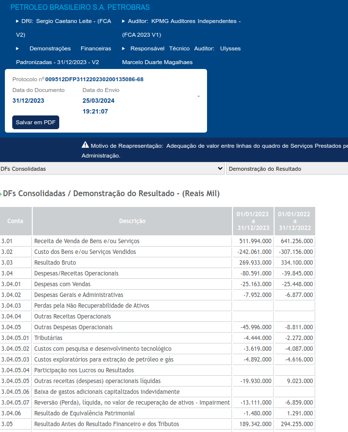
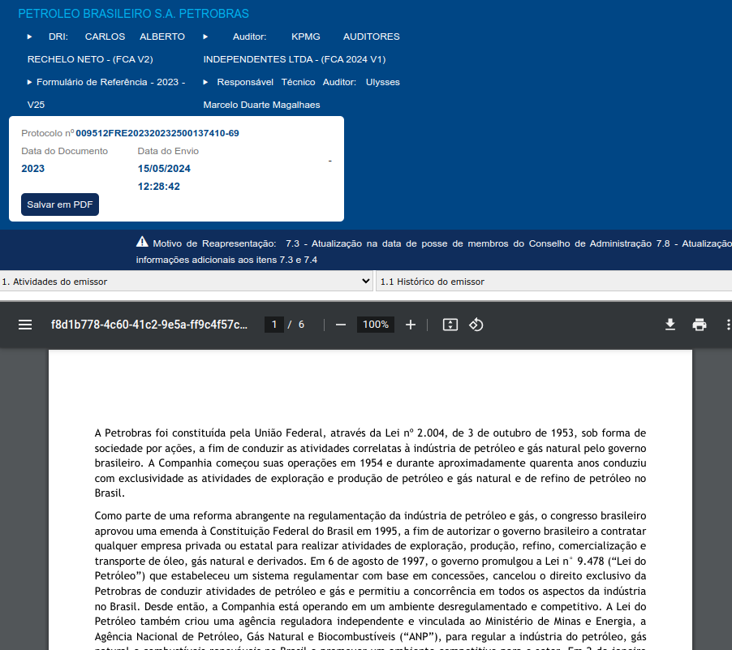
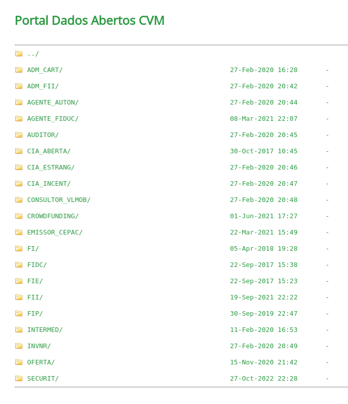
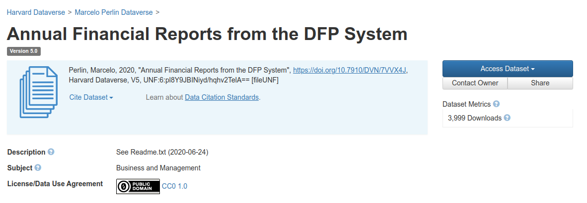

```{r}
classtools::setup_quarto_slides("templates")
```

# Motivação

## Documentos financeiros e pesquisa

> Demonstrações financeiras são o cerne dos estudos de finanças corporativas [@perlin2019accessing]. 

- ["Accessing financial reports and corporate events with GetDFPData"](https://periodicos.fgv.br/rbfin/article/view/78654), RBFIN 2019
  - em selecionadas revistas Qualis A2/B1, em torno de 70% dos estudos de finanças entre 2013-2017 se utilizaram do economática
  - O economática, na época, só permitia operações do tipo copia e cola
  - A B3 oferece acesso público aos seus conjuntos de dados em quatro sistemas diferentes: DFP, ITR, FRE e FCA, mas com várias limitações para o acesso em larga escala.


# Os sistemas da B3 e da CVM

## DFP e FRE (Exemplo para [Petrobrás](https://sistemaswebb3-listados.b3.com.br/listedCompaniesPage/main/9512/PETR/reports?language=pt-br) )

:::: {.columns}

::: {.column width="50%"}

:::

::: {.column width="50%"}

:::

::::

::: aside

:::

## Dados da CVM



::: aside
[Link dados](https://dados.cvm.gov.br/dados/) | [pdf mapa](https://dados.cvm.gov.br/recursos/CentralSistemas_DadosAbertos.pdf)
:::


# Pacotes GetDFPData2 e GetFREData

## Sobre o R

> O R é uma linguagem de programação voltada para a resolução de problemas estatísticos e para a visualização gráfica de dados.

Autores
: Ross Ihaka e Robert Gentleman (*The University of Auckland*)

Funcionalidade
:  R é sinônimo de programação voltada à análise de dados

Custo
:  **O R é totalmente livre** e disponível em vários sistemas operacionais.


## Curiosidades e funcionalidades

- A primeira versão do pacote foi uma tentativa de atualizar slides e exercícios da graduação automaticamente (Rmarkdown/quarto)

- Inicialmente, pacote GetDFPdata agregava dados do DFP e FRE juntamente. Posteriormente, separei os pacotes entre GetDFPData2 e GetFREData

> **GetDFPData2** fornece uma interface R aberta para todas as demonstrações financeiras **anuais** distribuídas pela B3 e CVM: DRE, BP, DFC, DMPL, DVA

> **GetFREData** permite download de tabelas do sistema FRE (Formulário de Referencia): controle acionário, membros do conselho de administração, remuneração dos conselheiros, relações familiares, entre váriso outros


# Workshop

## Pacote `GetDFPData2` -- Exemplo 01 (Grendene) {.scrollable}

> Passo 01: instalar pacote

```{r}
#| eval: false
install.packages("GetDFPData2")
```


> Passo 02: baixar dados das empresas disponíveis

```{r}
cache_folder <- "~/.cache/gdfpd2_cache"

df_info <- GetDFPData2::get_info_companies(
  cache_folder
)

df_info |>
  dplyr::glimpse()
```

<br><hr><br>

> Passo 03: identificar empresas

```{r}
df_search <- GetDFPData2::search_company("grendene")
df_search
```

<br><hr><br>


> Passo 04: baixar os dados

```{r}
id_company <- 19615 # Grendene
first_year <- 2015
last_year <- 2023

# download data
l_dfp <- GetDFPData2::get_dfp_data(
  companies_cvm_codes = id_company,
  first_year = first_year,
  last_year = last_year,
  cache_folder = cache_folder
)

names(l_dfp)
```

<br><hr><br>


> Passo 05: checar os dados

```{r}
bp_con <- l_dfp$`DF Consolidado - Demonstração do Resultado`  

dplyr::glimpse(bp_con)
```

<br><hr><br>

> Passo 06: analisar margem de lucro

```{r}
tbl_ind <- bp_con |>
  dplyr::group_by(CD_CVM, DENOM_CIA, DT_REFER) |>
  dplyr::summarise(
    margem_liq =  VL_CONTA[CD_CONTA == "3.11"]/VL_CONTA[CD_CONTA == "3.01"] # LL/Vendas
  ) |>
  dplyr::ungroup()

tbl_ind |>
  gt::gt() |>
  gt::tab_header("Margem de Lucro da Grendene") |>
  gt::fmt_percent(margem_liq)
```

<br><hr><br>

> Passo 04 - analisar a Grendene

```{r}
tbl_ind_company <- tbl_ind |>
  dplyr::filter(CD_CVM == 1023)

```

## Pacote `GetDFPData2` -- Exemplo 02 (todas empresas) {.scrollable}

> Passo 01 - baixar dados de todas empresas

```{r}
df_info <- GetDFPData2::get_info_companies(
  cache_folder
)

ids <- df_info$CD_CVM |> 
  unique()

l_dfp <- GetDFPData2::get_dfp_data(
    companies_cvm_codes = ids,
    first_year = 2010, 
    type_docs = "DRE",
    cache_folder = cache_folder
)
```

<br><hr><br>

> Passo 02 - checar os dados

```{r}
bp_con <- l_dfp$`DF Consolidado - Demonstração do Resultado`  
dplyr::glimpse(bp_con)
```

<br><hr><br>

> Passo 03 - calcular margens de lucro

```{r}
tbl_ind <- bp_con |>
  dplyr::group_by(CD_CVM, DENOM_CIA, DT_REFER) |>
  dplyr::reframe(
    margem_liq =  VL_CONTA[CD_CONTA == "3.11"]/VL_CONTA[CD_CONTA == "3.01"] # LL/Vendas
  ) |>
  dplyr::ungroup()

dplyr::glimpse(tbl_ind)
```

## Pacote `GetFREData` - exemplo 01 (grendene) {.scrollable}

> Passo 01 - baixar dados da Grendene

```{r}
id_company <- 19615 # Grendene
first_year <- 2015
last_year <- 2022

# download data
l_fre <- GetFREData::get_fre_data2(
  first_year = first_year,
  last_year = last_year,
  cache_folder = cache_folder
)
```

<br><hr><br>

> Passo 02 - checar os dados

```{r}
names(l_fre)
```

<br><hr><br>

> Passo 03- analisar composição atual do conselho

```{r}
df_boards <- l_fre$fre_cia_aberta_membro_comite
last_year <- max(df_boards$data_referencia)

df_board_current <- df_boards |>
  dplyr::filter(data_referencia == last_year)

df_board_current |>
  dplyr::select(nome,
                cpf, profissao,data_nascimento,
                data_eleicao) |>
  gt::gt() |>
  gt::tab_header(
    title = "Composição do Conselho -- GRENDENE", 
    subtitle = glue::glue("Dados para {last_year}"))
```


# Aprendizado

- Existe uma variedade imensa de dados públicos que podem ser usados em pesquisa
- Raspagem de dados de sites é momentânea e não-sustentável!
  - procura uma maneira oficial de coletar dados
  - evite raspar dados da B3!
- Cuidado com os dados que são raspados sem consentimento!
- O código vai evoluir, quanto mais simples, melhor..

# Próximos passos e dicas pacotes

## Próximos passos

1. Nova versão atualizada
    - revisar código
    - novo sistema de cacheamento
    - arrumar nomes das colunas
    - gestão de erros em download
    - usar dados da CVM (e não B3)
2. Olhar outros dados da CVM
3. Desenvolver pacote equivalente para dados do Edgar/SEC/USA


## Um acesso mais direto aos dados

> Anualmente, um script importa todos os dados disponíveis na B3, organiza os dados e disponibiliza no site [https://msperlin.com/data/](https://msperlin.com/data/)



## Produções resultantes

REICHERT, M. ; PERLIN, M. S. . What Drives the Release of Material Facts for Brazilian Stocks?. REVISTA BRASILEIRA DE FINANÇAS (IMPRESSO), v. 20, p. 01-15, 2022.

MASTELLA, M. ; PERLIN, MARCELO S. ; KIRCH, G. ; VANCIN, D. . Board gender diversity: performance and risk of Brazilian firms. GENDER IN MANAGEMENT (PRINT), v. ahead-of-print, p. 1-30, 2021. Citações:16|19

PERLIN, M. S.; KIRCH, G. ; MASTELLA, M. ; VANCIN, D. . O Impacto Da Titulação Acadêmica De Conselheiros E Diretores Sobre A Performance De Empresas Negociadas Na B3. BBR. BRAZILIAN BUSINESS REVIEW (EDIÇÃO EM PORTUGUÊS. ONLINE), v. 18, p. 561-584, 2021.

PERLIN, M. S.; KIRCH, G. ; VANCIN, D. . Accessing financial reports and corporate events with GetDFPData. REVISTA BRASILEIRA DE FINANÇAS: RBFIN = RBFIN: BRAZILIAN FINANCE REVIEW, v. 17, p. 85, 2019.

+38 citações do pacote em artigo publicado

## Curiosidades

```{r}
#| echo: false
df_cran <- cranlogs::cran_downloads(c("GetDFPData2", "GetFREData"),
                         from = "2021-01-01",
                         to = 'last-day')

by_month <- df_cran |>
  dplyr::mutate(ref_month = as.Date(format(date, "%Y-%m-01"))) |>
  dplyr::group_by(ref_month, package) |>
  dplyr::summarise(count = sum(count)) |> 
  dplyr::ungroup()

library(ggplot2)


p <- ggplot(by_month, aes(x = ref_month, y = count)) + 
  geom_col() + 
  facet_wrap(~package) + 
  labs(title = "Downloads de pacotes por mẽs") + 
  theme_light()

p
```


# Livros do R

## Introdução ao R -- Um guia prático para iniciantes

:::: {.columns}

::: {.column width="40%"}

```{r}
#| echo: false

```

:::

::: {.column width="60%"}

- publicado em abril/2024
- disponível como ebook e impresso na [Amazon](https://www.amazon.com.br/dp/B0CYN25PD6)
- versão online e **integral** em <https://www.msperlin.com/introR/>

:::
::::


## Programação e Análise de Dados com o R

:::: {.columns}

::: {.column width="40%"}

```{r}
#| echo: false


```

:::

::: {.column width="60%"}

- <span style="color:red">Em desenvolvimento! </span>
- **Provável** publicação em 2025

:::
::::


## Visualização de Dados com o R

:::: {.columns}

::: {.column width="40%"}

```{r}
#| echo: false

knitr::include_graphics("figs/CAPA-VisualizacaoDadosR-EBOOK.jpg")
```

:::

::: {.column width="60%"}

- Disponível como ebook e impresso na [Amazon](https://www.amazon.com.br/dp/B0BK2V4HTB)
- Versão online em <https://www.msperlin.com/vdr/>

:::

::::


## Questões de R em Concursos Públicos

:::: {.columns}

::: {.column width="40%"}

```{r}
#| echo: false

knitr::include_graphics("figs/CAPA-Questoes-de-R-EBOOK.jpg")
```

:::

::: {.column width="60%"}

- Disponível como ebook e impresso na [Amazon](https://www.amazon.com.br/dp/B0BK2V4HTB)
- Versão online em <https://www.msperlin.com/vdr/>

:::

::::


# Referências {-}
