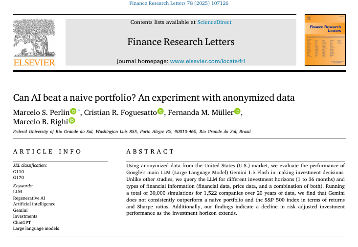
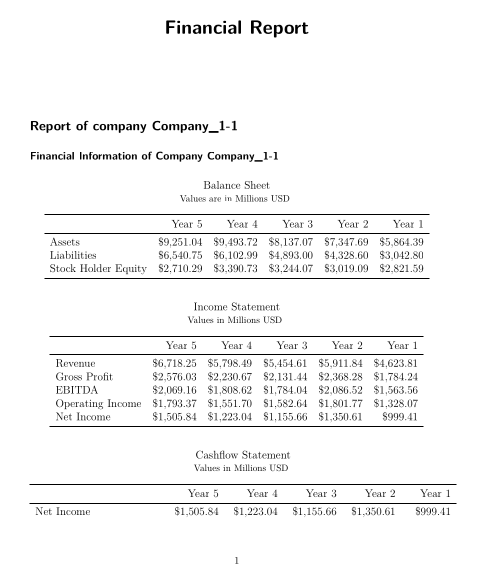
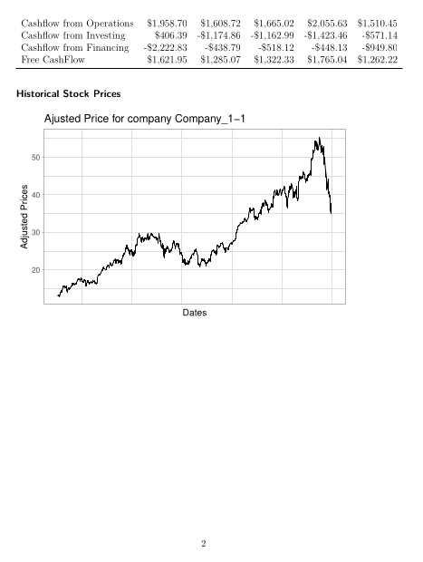
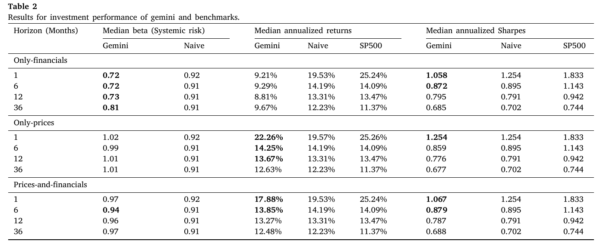
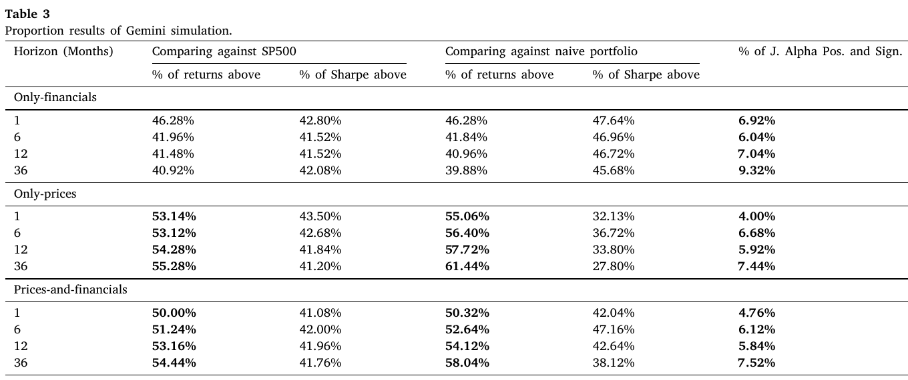

# Introduction

## 

[Link](https://www.sciencedirect.com/science/article/abs/pii/S1544612325003897)

## Introduction

> Large Language Models (LLMs) like Gemini and ChatGPT are transforming many fields, including finance.

::: {.incremental}
-   **Promise:** LLMs can process vast amounts of unstructured data (news, reports, text) to inform investment decisions.
-   **Prior Research:** Several studies show positive results, suggesting LLMs can help in:
    -   Asset selection and diversification [@ko2024can]
    -   Predicting future earnings [@pelster2024can]
    -   Sentiment analysis of news [@kirtac2024sentiment]
:::

## Too much hype?

> A critical flaw in many existing studies is the use of **non-anonymized data**.

::: {.incremental}
-   LLMs are black box models, trained on vast amounts of historical internet data.
-   If a study tests an LLM on 2010-2020 data, the LLM may **remember** that, for example, Apple was a good investment.
-  [ This is a clear case of **data leakage** ]{style="color:red;"}
:::

## Research Question

> Can Google's Gemini LLM consistently outperform simple benchmarks in a *truly blind test* using anonymized data?

:::{.incremental}
**Key Contributions:**

1.  **Novel Blind Experiment:** we omit any indication of stock ticker or time period of analyzed data

2.  **Heteregenous Inputs:** We test across different data types (financials vs. prices) and time horizons (1 to 36 months).

3.  **Large Scale:** We run 30,000 simulations using 20 years of data from 1,522 U.S. companies.
:::

# Data and Methods

## Data

- We use **real** financial statements and daily stock prices of U.S. companies from 2004 to 2024 (data from EODHD)

- All stock prices are adjusted for dividends, splits, and any other corporate event

- Based on the financial data, we follow an algorithm o build pdfs that are later analyzed by the LLM

## The Sampling Algorithm (1/2)

1. A random date between 2004 and 2023 is selected using uniform probabilities;

2. Based on the previous date, we randomly select 5 stocks from a sample of companies that respect all the following rules:
    - Prices and a history of financial documents (income statement, balance sheet, and cash-flow statement) from the last 5 years, counting from the random date, must be available;
    - There must be no penny prices (lower than 1 USD) in the past 5 years of price history;
    - In the past 5 years, the stock is traded with a daily average of financial volume higher than 250,000 dollars.

## The Sampling Algorithm (2/2)

3. With the 5 random stocks from previous step, we use **Quarto** to build a single pdf with **past** information for the 5 selected companies in the previous 5 years, with three versions of the file:
    - **only-financials**: a pdf version with only financial information (major registries in the Income Statement, Balance Sheet, and Cashflow statement);
    - **only-prices**: a version with only past adjusted prices of the stock, presented as a figure in the pdf;
    - **prices-and-financials**: a version with financial information and past prices.

4. All numerical data (prices, revenue, income, etc.) are multiplied by a single random factor (e.g., 0.453). Company names are replaced for generic names (e.g., "Company_1-1"). All dates are removed.

5. We than feed the LLM with the built pdf and ask it how much to invest (exact query later)

## Example of pdf

::: {.columns}

::: {.column width="50%"}

:::

::: {.column width="50%"}

:::

:::

## The Query

**System instructions**: _You are a financial analyst with expertise in analyzing the past performance of companies and picking winning stocks. In this task, you are analyzing past information about 5 publicly traded companies._

**Prompt**: _Today, you have 10,000 USD to invest for the next N-MONTHS months. You have 6 choices, 5 companies traded in the financial exchange, or invest in the risk-free rate named RISK-FREE-ASSET, which is currently yielding RF-YIELD of return per year. Return the response as json, with 6 elements, with the following structure in each element: "company", "investment"._

 

**N-MONTHS**: placeholder for the investing horizon in months. 

**RF-YIELD**: The current future yield rate. We use the most recent yield rate of the 5-year U.S. Treasury yield (ticker FVX) available on a random date from the simulation.

## Benchmarks and Metrics 

::: {.columns}
::: {.column}
**Benchmarks:**

1.  **S&P 500 Index:** The standard market benchmark.
2.  **Naive Portfolio:** An equal-weight (1/N) portfolio. 
:::
::: {.column}

**Key Metrics:**

1. **Annualized Return:** Total portfolio profit per year.
2. **Sharpe Ratio:** Risk-adjusted return.
3. **Alpha from market model:** Measures consistent, statistically significant outperformance.
:::

:::

# Results

## Investiment Performance

## Proportion results

# Conclusion and next steps

## Conclusions

1.  The overall success rate for Gemini was ~52%, indicating its performance is no better than a coin flip.

1.  Performance on a risk-adjusted (Sharpe) basis was even worse, with the model consistently underperforming benchmarks.

1. Risk-adjusted performance declined for all strategies as the investment horizon extended.

1.  [No consistent outperformance when using annonymous data!]{style="color:red;"}

---

## Limitations 

-   **Only Gemini:** This study did not test other LLMs like ChatGPT or Claude, which use different architectures.
-   **Anonymization Impact:** Is the anonymized data *too hard*? Perhaps LLMs *need* qualitative data (news, sentiment, company names) to be effective. This study does not rule out their usefulness in sentiment analysis.
-   **Future Work:**
    -   Compare Gemini vs. ChatGPT in this same blind test.
    -   Incorporate qualitative (textual) data in an anonymized way.
    -   Test dynamic trading strategies, not just buy-and-hold.

## Current Working Papers

- **Evaluation of LLMs in Finance**, with Felippe Affonso
        - which LLM are best for finance?
        - is price related to efficiency?

- **The use of AI in Financial Reports**, with Aliki and Cristian
        - are companies using AI for writing their 10-Ks?
        - what is the profile of companies using AI?

## References {-}
