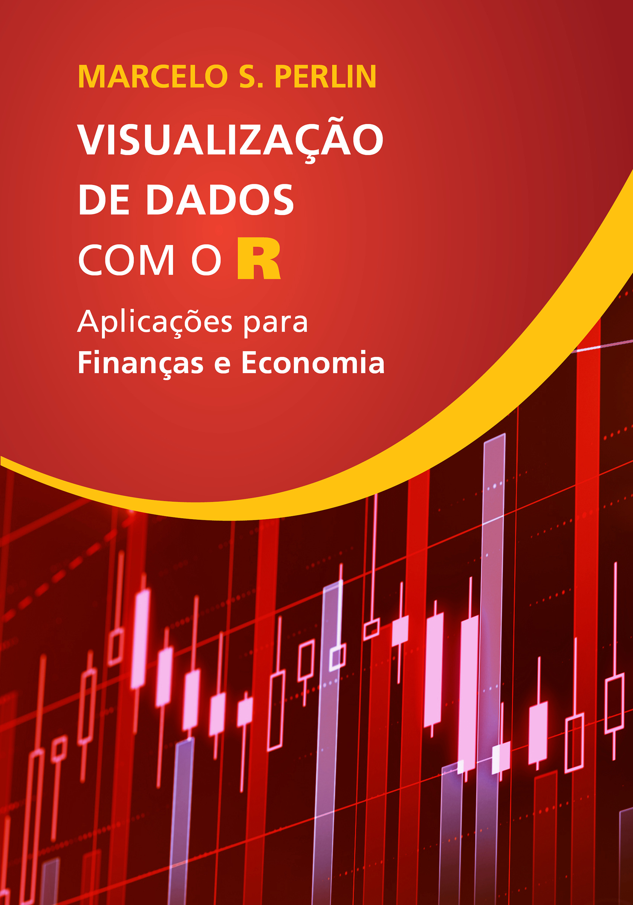
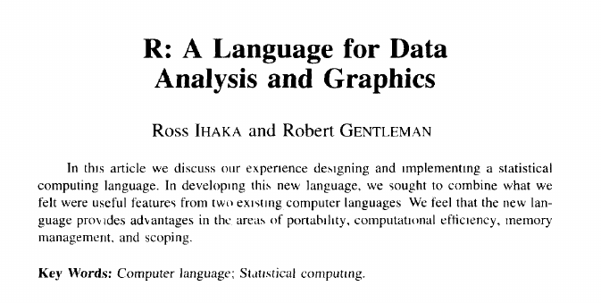

```{r}
#| echo: false
classtools::setup_quarto_slides("content")
```

# Quem sou 

## Prazer!

```{r}
#| eval: true
#| echo: false

my_email <- "marceloperlin@gmail.com"
my_website <- "https://www.msperlin.com/"

date_start <- as.Date("2011-01-01")
years_exp <- lubridate::year(lubridate::today()) - lubridate::year(date_start)
```

> Professor Associado na EA/UFRGS/PPGA, com mais de `r years_exp` anos de carreira em análise de dados voltada a ciência, finanças quantitativas e consultoria para empresas e órgãos públicos.

::: {.incremental}
- Apaixonado por análise de dados, programação e investimentos.
- Desenvolvedor e consultor em **R** e **Python**.
- Autor de diversos pacotes de código aberto no R: `yfR`, `GetTDData`, `GetBCBData`, etc.
- Autor de livros sobre análise de dados e investimentos 
- Contato
  - Email: [`r my_email`](emailto: `r my_email`) 
  - Site: [`r my_website`](`r my_website`)  
:::


## Livro sobre R

:::: {.columns}

::: {.column width="25%"}

:::

::: {.column width="25%"}

:::

::: {.column width="25%"}

:::

::: {.column width="25%"}

:::

::::

Links disponíveis na [página pessoal](https://msperlin.com/publication/#5)


# Porque aprender programação?

## Introdução {background-image="figs/programming-bg.jpg" background-opacity=0.2}

::: {.incremental}
- Automatizar tarefas repetitivas (menos trabalho, mais pensamento)
- Minimizaçao de erro humano (menos erros, mais confiança)
- Eficiência em reprodução de resultados de pesquisa;
- Ter controle total sobre o processo de análise, incluindo dependências de _software_;
- Ter acesso a uma variedade imensa de dados públicos e pacotes de código aberto;
- **Vantagem competitiva no mercado de trabalho**.
:::

# Sobre o R {background-image="figs/R_logo.svg.png" background-opacity=0.75}

## O que é o R {background-image="figs/R_logo.svg.png" background-opacity=0.5}

> Ross Ihaka and Robert Gentleman. R: A language for data analysis and graphics. Journal of Computational and Graphical Statistics, 5(3):299–314, 1996. 

{fig-align="center"}


## Por que Escolher o R {background-image="figs/R_logo.svg.png" background-opacity=0.5}

::: {.incremental}
-   R é uma plataforma madura, estável, continuamente suportada;
-   Linguagem estruturada, prática e fácil de aprender;
-   As interfaces de programação (RStudio/positron/vscode) facilitam o processo, principalmente para iniciantes;
-   Os pacotes do R permitem as mais diversas funcionalidades além da análise de dados, como:
    - Mandar email, contar piadas, fazer sites, criar relatórios estruturados, fazer provas, ...
-   O R tem compatibilidade com diferentes linguagens e sistemas operacionais (Windows, Linux, Mac).
-   **O R é totalmente gratuito e vai se manter assim!**
:::


# Os sistemas da B3 e da CVM

## Documentos financeiros e pesquisa

> Demonstrações financeiras representam o pilar central nos dados de estudos de finanças corporativas. ["Accessing financial reports and corporate events with GetDFPData"](https://periodicos.fgv.br/rbfin/article/view/78654), RBFIN 2019

:::{.incremental}
- em selecionadas revistas Qualis A2/B1, em torno de 70% dos estudos de finanças entre 2013-2017 se utilizaram do economática
- O economática, na época, só permitia operações do tipo copia e cola
- A B3 oferece acesso público aos seus conjuntos de dados em quatro sistemas diferentes: DFP, ITR, FRE e FCA, mas com várias limitações para o acesso em larga escala.
:::


## DFP e FRE (Exemplo para [Petrobrás](https://sistemaswebb3-listados.b3.com.br/listedCompaniesPage/main/9512/PETR/reports?language=pt-br) )

:::: {.columns}

::: {.column width="50%"}

:::

::: {.column width="50%"}

:::

::::


## Dados da CVM


::: aside
[Link dados](https://dados.cvm.gov.br/dados/) | [pdf mapa](https://dados.cvm.gov.br/recursos/CentralSistemas_DadosAbertos.pdf)
:::


## Pacotes GetDFPData2 e GetFREData

::: {.incremental}

- **GetDFPData2** fornece uma interface R aberta para todas as demonstrações financeiras **anuais** distribuídas pela B3 e CVM:
  - **Demonstrativos de Resultados do Exercício (DRE)**
  - **Balanço Patrimonial (BP)**
  - **Demonstração de Fluxo de Caixa (DFC)**
  - Demonstração de Mutações do Patrimônio Líquido (DMPL)
  - Demonstração das Valor Agregado (DVA)

- **GetFREData** permite download de tabelas do sistema FRE (Formulário de Referência):
  - controle acionário
  - membros e remuneração do conselho de administração
  - relações familiares
  - várias outras tabelas (30+)..

:::

# Exemplo pacote `GetDFPData2`

## Passo 01: instalar requisitos

1. instalar [R](https://cran.r-project.org/) e [RStudio](https://posit.co/download/rstudio-desktop/) para o seu sistema operacional
2. abrir o Rstudio e, no _prompt_, instalar o pacote `GetDFPData2` com os comandos abaixo

```{r}
#| eval: false

# usando base R
install.packages("GetDFPData2")

# usando pak (+ moderno)
pak::pak("GetDFPData2")

# versão no github (mais recente, mais instável)
pak::pak("msperlin/GetDFPData2")
```


## Passo 02: baixar dados das empresas disponíveis

- Função `get_info_companies()` baixa e carrega arquivo csv da CVM, com informações das empresas disponíveis atualmente no sistema DFP

```{r}
df_info <- GetDFPData2::get_info_companies()
```

- Resultado é uma tabela com diversas informações sobre as empresas listadas na B3, como código CVM, nome, setor, segmento, data de abertura, etc.:

## Amostra das `r nrow(df_info)` empresas disponíveis no sistema DFP 


```{r}
#| echo: false
tab <- df_info[, 1:5] |>
  head(5) |>
  gt::gt() |>
  gt::tab_header(
    title = "Tabela de empresas disponíveis no sistema DFP (amostra de colunas)"
    ) 

tab
```


## Passo 03: identificar empresas

- A identificação das empresas é feita por meio do código CVM, que é um número inteiro único para cada empresa listada na B3.

- Para procurar o código CVM de uma empresa, pode-se usar a função `search_company()`, que permite buscar por nome ou parte do nome da empresa.

```{r}
df_search <- GetDFPData2::search_company(
  "grendene"
  )
```

- O código da Grendene é `r as.character(df_search$CD_CVM[1])`, e o nome oficial é `r df_search$DENOM_SOCIAL[1]`

## Passo 04: baixar os dados

- Os dados podem ser baixados para uma ou mais empresas, usando a função `get_dfp_data()`, que requer o código CVM da empresa e o período de interesse (ano inicial e ano final).

```{r}
l_dfp <- GetDFPData2::get_dfp_data(
  companies_cvm_codes = 19615,
  first_year = 2020,
  last_year = 2025
)
```

- A saída é uma lista `l_dfp` com os dados organizados por tipo de demonstração financeira (DRE, BP, DFC, etc.) e por forma de apresentação (consolidado ou individual).

## Passo 05: checar os dados

```{r}
dre_con <- l_dfp$`DF Consolidado - Demonstração do Resultado`
```

```{r}
#| echo: false
dre_con |>
  head(n = 10) |>
  dplyr::select(CD_CVM, DENOM_CIA, DT_REFER, CD_CONTA, DS_CONTA, VL_CONTA) |>
  gt::gt() |>
  gt::tab_header("DRE Consolidado da Grendene") |>
  gt::fmt_currency(VL_CONTA)
```


## Passo 06: analisar margem de lucro

```{r}
tbl_ml <- dre_con |>
  dplyr::group_by(CD_CVM, DENOM_CIA, DT_REFER) |>
  dplyr::reframe(
    Vendas = VL_CONTA[CD_CONTA == "3.01"], # Receita Líq
    LL = VL_CONTA[CD_CONTA == "3.11"], # Lucro Líquido
    margem_liq =  LL/Vendas
  ) 
```

```{r}
#| echo: false
tbl_ml |>
  gt::gt() |>
  gt::tab_header("Margem de Lucro da Grendene") |>
  gt::fmt_percent(margem_liq)
```


## Pacote `GetDFPData2` -- Exemplo 02 (todas empresas) {.scrollable}

- Passo 01 - baixar dados de todas empresas

```{r}
ids <- df_info$CD_CVM |> 
  unique()

l_dfp <- GetDFPData2::get_dfp_data(
    companies_cvm_codes = ids,
    first_year = 2020,
    last_year = 2025,
    type_docs = "DRE"
)

dre_con <- l_dfp$`DF Consolidado - Demonstração do Resultado`
```

## Passo 02 - calcular margens de lucro

```{r}
tbl_ml_all <- dre_con |>
  dplyr::group_by(CD_CVM, DENOM_CIA, DT_REFER) |>
  dplyr::reframe(
    Vendas = VL_CONTA[CD_CONTA == "3.01"], # Receita Líq
    LL = VL_CONTA[CD_CONTA == "3.11"], # Lucro Líquido
    margem_liq =  LL/Vendas
  ) 
```

## Grafico de margens de lucro da Grendene

```{r}
#| echo: false
#| fig-align: "center"
library(ggplot2)

mean_margem <- mean(tbl_ml$margem_liq, na.rm = TRUE)

ggplot(tbl_ml, aes(x = factor(lubridate::year(DT_REFER)), y = margem_liq)) +
  geom_col(fill = "steelblue") +
  geom_hline(yintercept = mean_margem, color = "red", linetype = "dashed", linewidth = 1) +
  labs(
    x = "Ano",
    y = "Margem Líquida"
  ) +
  scale_y_continuous(labels = scales::percent_format(accuracy = 1)) +
  theme_minimal(base_size = 16)
```

## Margem de lucro de todas as empresas (2020-2025)

```{r}
#| echo: false
tbl_ml_all |>
  head(10) |>
  gt::gt() |>
  gt::tab_header("Margem de Lucro de todas as empresas") |>
  gt::fmt_percent(margem_liq)
```

## Gráfico de margens de lucro de todas as empresas

```{r}
#| echo: false
#| fig-align: "center"
library(ggplot2)
library(dplyr)

last_year_data <- max(tbl_ml_all$DT_REFER, na.rm = TRUE)
df_info <- GetDFPData2::get_info_companies()

tbl_ml_all_filtered <- tbl_ml_all |>
  inner_join(df_info |> select(CD_CVM, SIT_REG), by = "CD_CVM") |>
  filter(DT_REFER == last_year_data, !is.na(margem_liq), !is.infinite(margem_liq), SIT_REG == "ATIVO",
  margem_liq < 1) |>
  unique() |>
  arrange(desc(margem_liq)) |>
  head(25)

ggplot(tbl_ml_all_filtered, 
       aes(
        x = margem_liq, 
        y = forcats::fct_reorder(DENOM_CIA, margem_liq)
        )
        ) +
  geom_col(fill = "steelblue") +
  labs(
    x = "Margem Líquid (LL/Vendas)",
    y = "Empresa"
  ) +
  scale_x_continuous(labels = scales::percent_format(accuracy = 1)) 
```

# Exemplo pacote `GetFREData` 

## Passo 01: baixar dados da Grendene

- Funcão `get_fre_data2()` baixa e limpa os dados do sistema FRE

```{r}
# download data
l_fre <- GetFREData::get_fre_data2(
  first_year = 2025,
  last_year = 2025
)
```

## Passo 02 - checar os dados

```{r}
#| echo: false
n_tbls <- 10
```

- `r n_tbls` primeiros elementos (são `r length(l_fre)` no total)

```{r}
names(head(l_fre, n = n_tbls))
```

## Passo 03- analisar posição acionária

```{r}
df_stockholders <- l_fre$fre_cia_aberta_posicao_acionaria
last_year <- max(df_stockholders$data_referencia)

current_stockholders <- df_stockholders |>
  dplyr::filter(
    data_referencia == last_year,
    nome_companhia == "GRENDENE S.A."
    ) |>
  dplyr::select(
    id_acionista,
    acionista,
    percentual_acao_ordinaria_circulacao
    ) |>
  dplyr::arrange(
    dplyr::desc(percentual_acao_ordinaria_circulacao)
  )
```

## Atual posição acionária da Grendene

```{r}
#| echo: false
tbl_stockholders <- current_stockholders  |>
  gt::gt() |>
  gt::tab_header(
    title = "Acionistas da GRENDENE", 
    subtitle = glue::glue("Dados para {last_year}"))

tbl_stockholders
```


# O que aprendi nesse processo

- Existe uma variedade imensa de dados públicos que podem ser usados em pesquisa
- Raspagem de dados de sites é momentânea e não-sustentável!
  - procure uma maneira oficial de coletar dados, preferência por APIs oficiais, ou pacotes de código aberto que já fazem isso
- Cuidado com os dados que são raspados sem consentimento!
- O código vai evoluir, quanto mais simples, melhor..

# Obrigado! {.unlisted}

