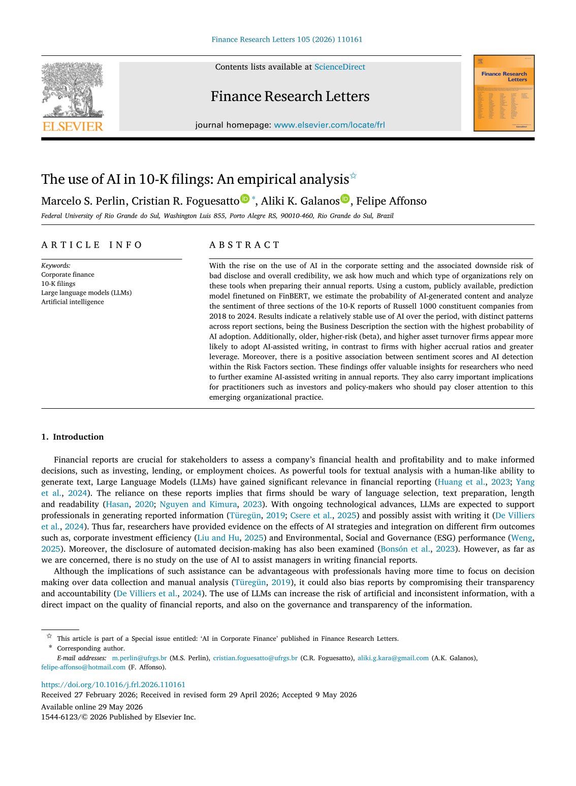
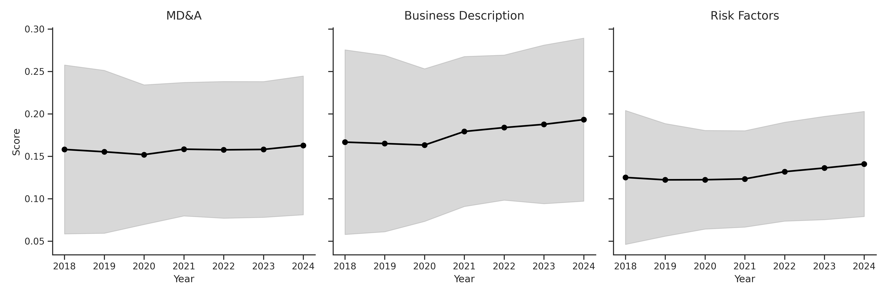
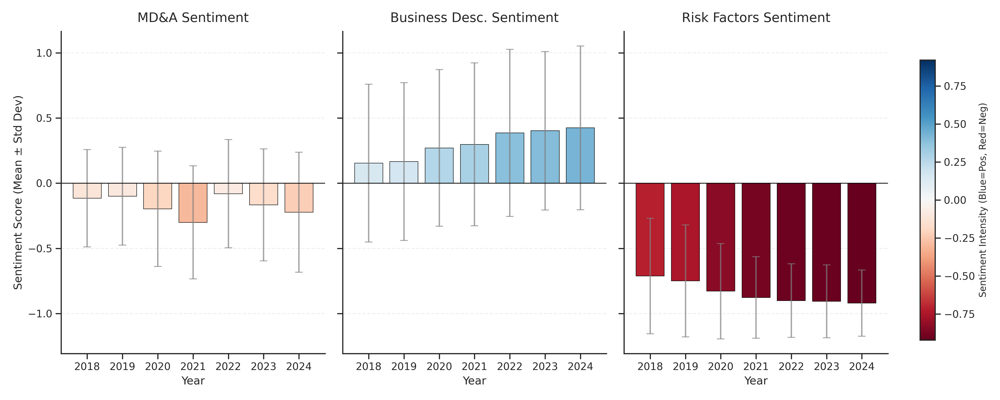

## The paper is published at FRL

{fig-align="center" height="750px"}

---

## Introduction: AI in Corporate Reporting
::: {.slide-subtitle}
Generative AI and Large Language Models (LLMs) in financial narrative drafting
:::

::: {.incremental}
* **Critical Channels**: Financial reports (10-Ks) are the cornerstone of corporate information disclosure for investors.
* **The AI Shift**: Rise of LLMs (ChatGPT, Gemini, Claude) allows managers to automate report writing.
* **Core Question**: How much and which types of firms rely on AI-assisted writing in annual reports?
:::

## Incentives and Risks of AI in Corporate Reporting

:::: {.columns}

::: {.column width="50%"}
### Incentives to use AI

::: {.incremental}
* Streamlines administrative processes and minimizes cost
* Frees manager time for decision-making
* Enhances narrative readability
:::

:::

::: {.column width="50%"}
### Problems

::: {.incremental}
* Generates artificial or generic text
* Risk of "hallucinations"
* Potential loss of legal precision
* Misleading investors with overly positive tone
:::

:::

::::

---

## Research Scope & Objectives
::: {.slide-subtitle}
Key questions and target text segments in 10-K filings
:::

:::: {.columns}

::: {.column width="80%"}
::: {.column-title}
Three Core Questions
:::
1. **Prevalence**: How much AI is used in writing corporate annual reports?
2. **Determinants**: Which firm characteristics predict AI adoption?
3. **Tone**: How does AI-assisted writing associate with disclosure sentiment?
:::

::::

---

## 10-K Narrative Sections: BD, RF, and MD
::: {.slide-subtitle}
Understanding the three core text segments analyzed
:::

::: {.incremental}
* **BD (Business Description - Item 1)**:
  * Details the company's core operations, products, services, subsidiaries, and target markets.
  * Highly descriptive and standardizable, providing a fundamental snapshot of the business.
* **RF (Risk Factors - Item 1A)**:
  * Discloses significant risks that could adversely affect the firm's financial condition or stock price.
  * High-stakes section requiring precise legal language and cautionary tone to prevent liability.
* **MD (Management's Discussion and Analysis - Item 7)**:
  * Management's perspective on financial results, liquidity, capital resources, and known trends.
  * Analytical and forward-looking, explaining the "why" behind the financial numbers.
:::

---

## Data & Sample Construction
::: {.slide-subtitle}
Data collection scope and final descriptive sample
:::

:::: {.columns}

::: {.column width="50%"}
::: {.column-title}
Sources & Scope
:::
* **Text Source**: 10-K sections (BD, RF, MD) retrieved directly from the official SEC API using `EdgarTools` (Python).
* **Financial Data**: Russell 1000 index constituents and financial ratios from `EODHD`.
* **Coverage**: Represents **$\approx$ 90%** of the traded volume in American stock exchanges.
* **Timeline**: **2018 to 2024** (spanning pre-hype and post-ChatGPT periods).
:::

::: {.column width="25%"}
::: {.custom-card .emerald}
::: {.card-title}
3,939 Observations
:::
Matched company-year narrative and financial data points.
:::

::: {.custom-card .coral style="margin-top: 1rem;"}
::: {.card-title}
18% Data Loss
:::
Standard attrition due to matching textual and financial filings.
:::
:::

::: {.column width="25%"}
::: {.custom-card .accent}
::: {.card-title}
570 Unique Firms
:::
Large cross-section representing established American corporations.
:::

::: {.custom-card style="margin-top: 1rem;"}
::: {.card-title}
Three Databases
:::
Separate textual corpora compiled for BD, RF, and MD sections.
:::
:::

::::

---

## Methodology: AI Detection & Processing
::: {.slide-subtitle}
Fine-tuning FinBERT and aggregating segment-level probabilities
:::

:::: {.columns}

::: {.column width="50%"}
::: {.column-title}
The AI Detector Model
:::
* **Base**: Fine-tuned on `yiyanghkust/finbert-pretrain` for financial context.
* **Ground Truth**:
  * 3,000 pre-AI chunks (2015-2020) as *Human*.
  * Paraphrased via **Gemini 2.5 Flash**, **ChatGPT**, and **Claude Haiku** as *AI*.
* **Splitting**: 70% Train, 30% Test.

### Robust Test Metrics
* **Accuracy**: **89.17%** | **F1-Score**: **88.58%**
* **Precision**: [92.65%]{.text-cyan .text-bold} (minimal false positives)
* **Recall**: **84.85%**
:::

::: {.column width="50%"}
::: {.column-title}
Text Processing & Sentiment
:::
* **Sliding Window Technique**:
  * FinBERT is limited to **512 tokens**.
  * **Solution**: Chunks of **500 tokens** with **50 overlap** (10%).
  * AI score = **simple average** of chunk probabilities.
* **Sentiment Score**:
  * Standard FinBERT classifier applied to chunks.
  * Ignored neutral chunks.
  * Score = Average of positive (+1) and negative (-1) chunks.
:::

::::

---

## Descriptive Statistics
::: {.slide-subtitle}
Summary of company variables and text indicators (2018-2024)
:::

| Variable | N | Mean | Std Dev | Min | Max |
|:---|:---:|:---:|:---:|:---:|:---:|
| **Panel A: Company Variables** | | | | | |
| ROE | 6,301 | 0.206 | 5.755 | -105.913 | 239.107 |
| ROA | 6,301 | 0.055 | 0.413 | -8.949 | 21.117 |
| IPO Year (Median) | 6,098 | 1997 | 15 | 1919 | 2024 |
| Age (years since IPO) | 6,098 | 23.0 | 14.8 | -6.0 | 105.0 |
| Log Size | 6,301 | 10.122 | 0.647 | 7.389 | 12.602 |
| Leverage | 6,301 | 0.693 | 3.020 | 0.000 | 238.549 |
| Beta (Market Risk) | 6,156 | 1.019 | 0.474 | -4.054 | 5.950 |
| Asset Turnover | 6,301 | 0.718 | 2.326 | -0.069 | 95.086 |
| Accrual Ratio | 6,301 | 0.024 | 0.628 | -1.897 | 44.745 |
| **Panel B: Text Variables** | | | | | |
| **BD Score (AI Prob)** | 5,405 | [0.178]{.text-cyan .text-bold} | 0.095 | 0.009 | 0.959 |
| **RF Score (AI Prob)** | 5,465 | 0.129 | 0.063 | 0.011 | 0.845 |
| **MD Score (AI Prob)** | 5,483 | 0.158 | 0.085 | 0.007 | 0.849 |
| BD Sentiment | 6,294 | [0.301]{.text-emerald .text-bold} | 0.624 | -1.000 | 1.000 |
| RF Sentiment | 6,294 | [-0.843]{.text-coral .text-bold} | 0.352 | -1.000 | 1.000 |
| MD Sentiment | 6,294 | -0.170 | 0.426 | -1.000 | 1.000 |

::: {style="font-size: 0.6em; color: #475569; margin-top: 0.4rem; text-align: left;"}
**Core Insight:** Business Description (BD) has the highest average AI usage (17.8%). Text sentiments conform to purpose: Risk Factors is highly negative, while BD is positive.
:::

---

## Research Hypotheses & Variables
::: {.slide-subtitle}
Explanatory variables and predicted signs with AI usage
:::

| Variable | Predicted Sign | Core Theoretical Rationale |
|:---|:---:|:---|
| **ROE (Profitability)** | [+]{.text-emerald .text-bold} | Richer firms have resources to adopt emerging AI tools. |
| **Age (Maturity)** | [-]{.text-coral .text-bold} | Younger firms are agile and less resistant to workflow changes. |
| **Log Size (Scale)** | [-]{.text-coral .text-bold} | Larger firms face bureaucratic inertia and manual reporting layers. |
| **Risk (Beta)** | [+]{.text-emerald .text-bold} | High-risk firms require extensive and polished explanations. |
| **Leverage** | [+]{.text-emerald .text-bold} | Highly leveraged firms face more creditor and investor scrutiny. |
| **Sentiment** | [+]{.text-emerald .text-bold} | LLMs naturally generate polished, positive, and neutral corporate drafts. |
| **Asset Turnover** | [+]{.text-emerald .text-bold} | Operationally efficient firms prioritize administrative process automation. |
| **Accrual Ratio** | [+]{.text-emerald .text-bold} | Accounting complexity requires detailed technical narratives. |

---

## Econometric Framework
::: {.slide-subtitle}
Generalized Linear Models (GLM) specification
:::

* **Why GLM?**: Probability $p(AI)_{i,t}$ is bounded on $[0,1]$. Standard OLS is misspecified.
* **Specification**: Quasibinomial distribution with a **logit link function**:
  
  $$\mathbb{E}(AI_{i,t}) = \frac{1}{1 + e^{-z_{i,t}}}$$
  
  $$z_{i,t} = \alpha + \theta X_{i,t}$$

* **Controls**: Sector dummies & year fixed effects.
* **Sample**: Limited to **2022–2024** (post-ChatGPT launch).

---

## Trend Analysis: AI Probability Over Time
::: {.slide-subtitle}
Temporal patterns of AI-assisted writing probability across 10-K sections
:::

{width=95%}

## Key Takeaways

* **Stable Adoption**: Probability remains relatively steady over the 2018–2024 period.
* **Constant Ordering**:
  1. **Business Description (BD)**: Highest ($\approx$ 17.8%)
  2. **Management Discussion (MD)**: Intermediate ($\approx$ 15.8%)
  3. **Risk Factors (RF)**: Lowest ($\approx$ 12.9%)
* **2024 Divergence**: Error bands widen in 2024, showing that a subset of firms is adopting AI aggressively.

---

## The "ChatGPT Shock" & Structural Breaks
::: {.slide-subtitle}
Chow structural break tests around ChatGPT public release (2022)
:::

:::: {.columns}

::: {.column width="45%"}
::: {.column-title}
Structural Break Findings
:::
* **Hypothesis**: ChatGPT launch in late 2022 created a structural break in corporate AI adoption.
* **Methodology**: Chow test on annual averages using an intercept-only model ($y_t = \alpha + \epsilon_t$) with 2022 as breakpoint.
* **Results**:
  * **Risk Factors (RF)**: Highly significant structural break ($p = 2.29\%$).
  * **Business Description (BD)**: Moderate break ($p = 10.12\%$).
  * **Management Discussion (MD)**: Inconclusive ($p = 15.17\%$).
:::

::: {.column width="55%"}
::: {.column-title}
Structural Break Results (Chow)
:::

| 10-K Section | Mean Before | Mean After | F-Stat | p-value |
|:---|:---:|:---:|:---:|:---:|
| **Business Description** | 16.85% | 18.78% | 4.501 | [10.12%]{.text-purple .text-bold} |
| **Risk Factors** | 12.16% | 13.56% | 12.923 | [2.29%]{.text-emerald .text-bold} |
| **Management Discussion** | 15.44% | 15.86% | 3.128 | 15.17% |

::: {style="font-size: 0.6em; color: #475569; margin-top: 1rem; border-left: 3px solid #0284C7; padding-left: 10px;"}
Data shows statistically robust evidence of a structural upward shift in AI usage after 2022, especially in high-stakes Risk Factors.
:::
:::

::::

---

## Sentiment Dynamics in 10-K Narratives
::: {.slide-subtitle}
Distribution of FinBERT sentiment scores across 10-K sections
:::

{width=95%}

---

## Econometric Results: Pooled GLM
::: {.slide-subtitle}
Determinants of AI-assisted writing (2022-2024)
:::

| Variable | Business Description (BD) | Risk Factors (RF) | Management Discussion (MD) |
|:---|:---:|:---:|:---:|
| **ROE (Profitability)** | -0.027 (0.019) | -0.001 (0.016) | -0.004 (0.020) |
| **Age (Maturity)** | **0.003 (0.001)**$^{***}$ | **-0.003 (0.001)**$^{***}$ | **0.002 (0.001)**$^{*}$ |
| **Log Size (Scale)** | **-0.077 (0.026)**$^{***}$ | **0.153 (0.021)**$^{***}$ | 0.024 (0.026) |
| **Risk (Beta)** | 0.026 (0.030) | **0.065 (0.025)**$^{**}$ | 0.014 (0.031) |
| **Leverage** | -0.024 (0.056) | 0.008 (0.047) | **-0.127 (0.058)**$^{**}$ |
| **Sentiment** | -0.016 (0.019) | [0.196 (0.089)]{.text-cyan .text-bold}$^{**}$ | -0.025 (0.027) |
| **Asset Turnover** | 0.018 (0.025) | **0.056 (0.021)**$^{***}$ | **0.049 (0.026)**$^{*}$ |
| **Accrual Ratio** | **-0.739 (0.203)**$^{***}$ | **-0.314 (0.170)**$^{*}$ | -0.299 (0.211) |
| **Year** | **0.038 (0.014)**$^{***}$ | **0.048 (0.012)**$^{***}$ | 0.023 (0.015) |
| Sector Dummies | Yes | Yes | Yes |
| Deviance | 115.543 | 63.518 | 104.962 |
| Observations | 2,409 | 2,409 | 2,409 |

::: {style="font-size: 0.55em; color: #475569; margin-top: 0.2rem; text-align: left;"}
Note: Standard errors are in parentheses. $^{*}p<0.1$; $^{**}p<0.05$; $^{***}p<0.01$. Profitability (ROE) is insignificant in all sections.
:::

---

## Econometric Findings & Core Interpretations
::: {.slide-subtitle}
Economic takeaways from firm-level determinants of AI usage
:::

:::: {.columns}

::: {.column width="50%"}
::: {.column-title}
Firm Characteristics
:::
* **ROE (Profitability)**:
  * Insignificant. Reject budget-constraint hypothesis: AI is not a luxury tool.
* **Firm Age (Maturity)**:
  * Older firms use AI in BD and MD; younger in RF. Mature firms automate operational descriptions.
* **Firm Size (Scale)**:
  * Larger firms use AI to write Risk Factors, but avoid it in BD descriptions.
:::

::: {.column width="50%"}
::: {.column-title}
Fundamentals & Complexity
:::
* **Operational Efficiency (Turnover)**:
  * Positively predicts AI in RF and MD sections.
  * Highly efficient firms use automation to cut administrative friction.
* **Accounting Complexity (Accruals)**:
  * Negatively predicts AI in BD and RF.
  * Complex firms avoid AI in narrative disclosures, likely fearing inaccuracies.
* **Financial Risk (Leverage)**:
  * Negatively predicts AI in MD. Leveraged firms avoid AI due to close creditor monitoring.
:::

::::

---

## Discussion: Strategic Framing & Regulatory Impact
::: {.slide-subtitle}
Efficiency gains vs impression management in corporate reporting
:::

:::: {.columns}

::: {.column width="50%"}
::: {.column-title}
Efficiency vs Legal Caution
:::
* **Operational Optimization**:
  * BD section has the highest AI adoption. Writing BD is routine and descriptive. Managers optimize standardizable tasks using AI.
* **Risk Avoidance in High-Stakes Text**:
  * Lower AI adoption in MD and RF sections. Managers avoid automated text where precise legal language is crucial, fearing liability.
:::

::: {.column width="50%"}
::: {.column-title}
Strategic Polish (Impression Management)
:::
* **Tone Polishing in Risk Factors**:
  * Strong positive link between sentiment and AI in RF.
  * Managers use LLMs' positive-neutral prose bias to "polish" or soften the impact of risk disclosures.
  * **Trade-Off**: Improves text readability but risks introducing boilerplate, generic disclosures, exacerbating information asymmetry.
:::

::::

---

## Conclusion
::: {.slide-subtitle}
Summary of academic contributions and practical takeaways
:::

* **AI Classifier**: Developed fine-tuned, high-precision (**92.65%**) FinBERT-based corporate text AI detector.
* **Prevalence Patterns**: Documented systematic, section-dependent AI adoption in 10-K reports (BD $>$ MD $>$ RF).
* **Tone Management**: Provided first empirical evidence of dynamic "tone polishing" in Risk Factors using AI.

## Present studies

- **Predicting layoff announcements from 10-Ks using LLMs (AI)**. Joint work with Felipe Affonso

- **Analyzing personality based on pictures and signatures of CEOs, and its impact on financial performance.** Joint work with Aliki K. Galanos 

- **The impact of AI in a large academic system**. TBD

---

## Thank You! {data-background-image="fig/robot_reading.jpg" data-background-size="cover" data-background-opacity="0.25"}

**Questions?**
